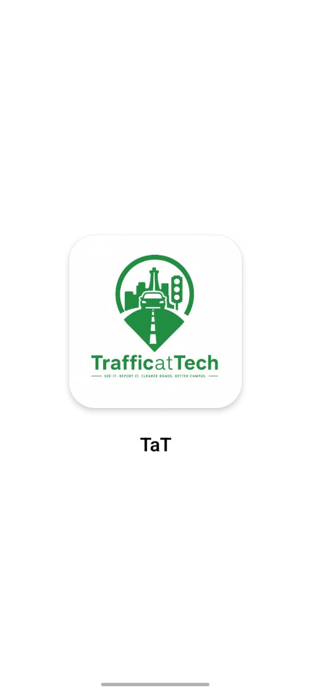
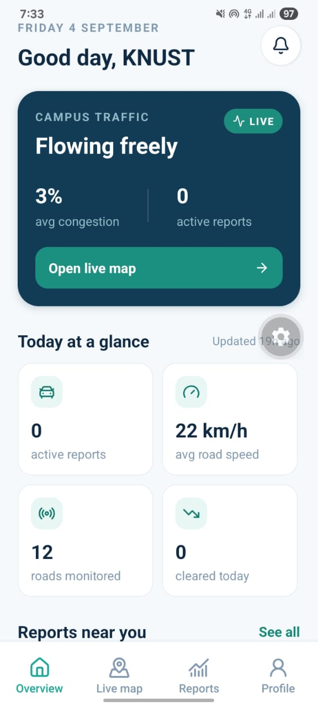
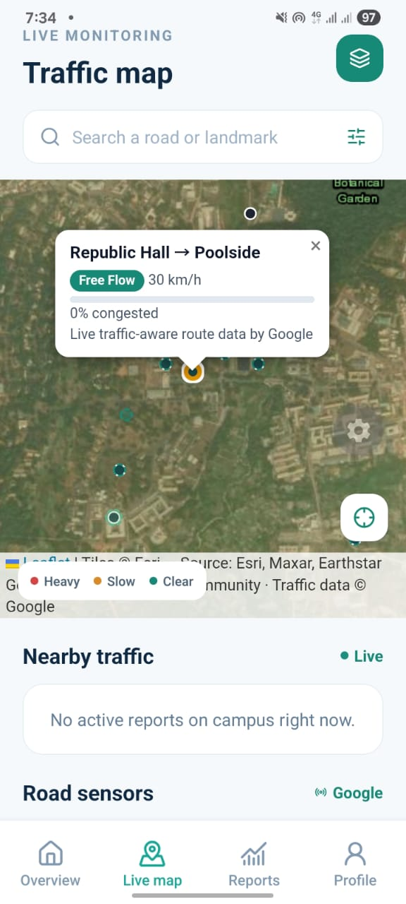
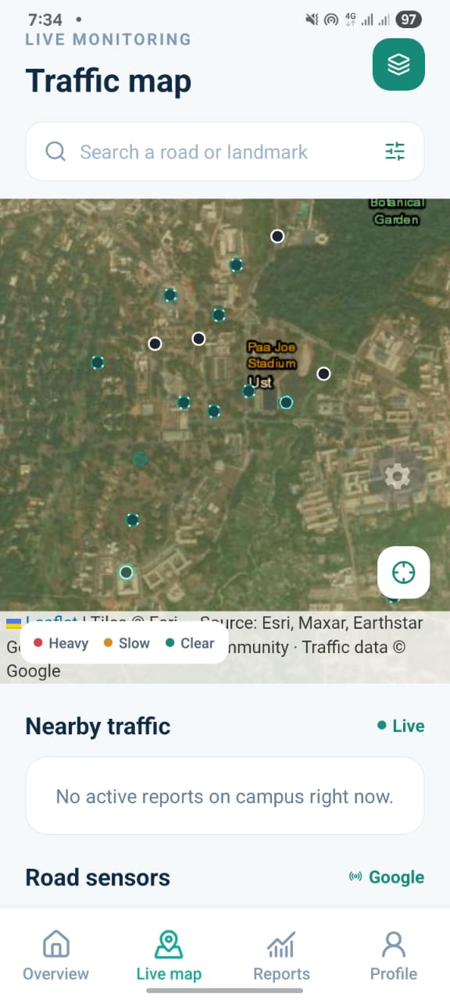
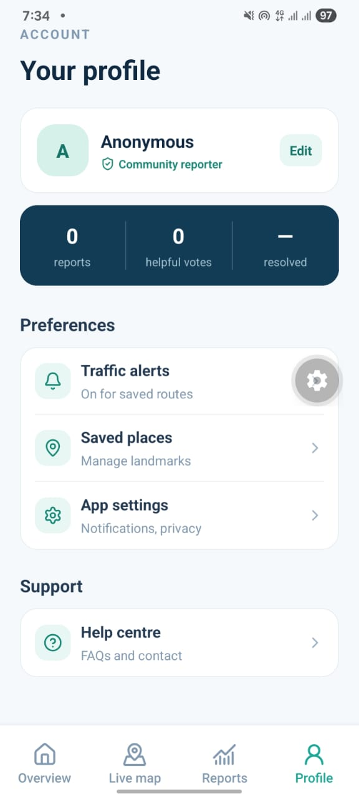
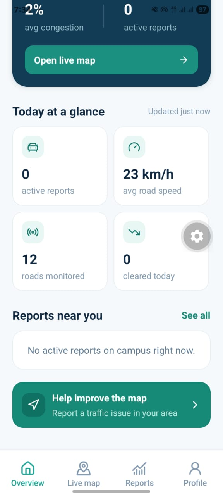

# KNUST Traffic (TAT)

A real-time, community-driven traffic monitoring application designed for
KNUST campus. TAT allows students and campus users to view traffic conditions,
report incidents, and receive updates about traffic congestion.

This is the polished 5-tab UI design, now wired to a fully real backend —
same Supabase project, same tables, same `ambient-traffic` edge function
(Google Compute Routes-based live traffic data) used by the other builds.
Nothing in this app is mock data.

## Features

- 🚦 Real-time traffic monitoring
- 🗺️ Interactive traffic map
- 📍 GPS-based user location
- 📢 Community traffic reports
- 🔔 Real-time notifications
- 👤 User profile and statistics
- 👍 Community helpful votes
- 🚧 Accident, blockage, construction and heavy-traffic reports
- ⏱️ Active traffic reports and readings

## screenshots

<p align="center">
  
  
  
</p>

<p align="center">
  
  
  
</p>

<p align="center">
  
</p>

## What's real

- **Overview, Map, Reports, Notifications, Profile** — all pull from and
  write to the same Supabase project (`traffic_reports`, `profiles`,
  `ambient_traffic_readings`), in real time.
- **Map** — a satellite Leaflet map (Esri imagery) inside a WebView, showing
  real community reports and real live-traffic segments, plus a "follow me"
  GPS mode that tracks your position as you move.
- **Reports** — submitting a report uses your actual GPS position to detect
  the nearest campus landmark, and writes a real row to the database.
- **Notifications** — a live feed of actual active reports and congested
  road segments, not a static list.
- **Profile** — your name is stored via `AsyncStorage` + Supabase; the
  "reports / helpful votes / resolved" stats are computed from your real
  submitted reports, not fabricated numbers.

## Technologies

- React Native
- Expo SDK 57
- TypeScript
- Supabase
- PostgreSQL
- Leaflet
- OpenStreetMap / Esri satellite imagery
- Google Compute Routes API
- Supabase Edge Functions
- AsyncStorage

## Setup

1. Copy `.env.example` to `.env` and fill in your Supabase project's URL
   and anon/publishable key:

   ```env
   EXPO_PUBLIC_SUPABASE_URL=https://your-project-ref.supabase.co
   EXPO_PUBLIC_SUPABASE_ANON_KEY=your_key
